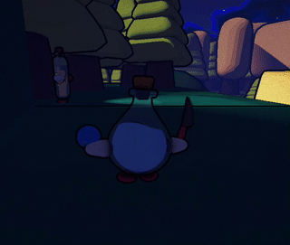
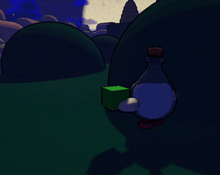
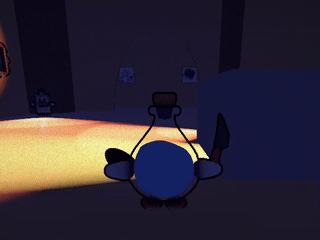

# Rogue in a Bottle - Pirate Software 15 Entry 
[Our entry](https://themagnat.itch.io/rogue-in-a-bottle) to the [Pirate Software Game Jam 15](https://itch.io/jam/pirate).

## How to play
Simply download the lastest release executable and start the game !

## Description
Rogue In A Bottle is an infiltration/exploration game about crafting power ups to avoid getting burnt by light.
Crafting uses resources that require exploring the levels to find them and progress in the game. Will you triumph over light ?

### Spells
You may need specific spells to be able to spread shadows into these lands.

Using your old book and some alchemy tricks, you will be able to create some powerful spells :

#### Potion of disturbance
Your targets can't help but look in your direction ?

This won't be a problem after you get your hand on your Potion of disturbance.

This spell will allow you to throw a glass bottle which will shatter at the slightest contact and will distract your opponents.

#### Ivy Wall
Become one with nature and gain the ability to make ivy sprout from the ground with the Ivy Wall.

In addition to being eco-friendly, this spell will allow you to hide from horrible sources of light but also to obstruct the vision of your enemies

#### Shade Cloak
Instead of hiding yourself in it, embrace the darkness with the Shade Cloak.

With this occult item, become a shadow yourself and blend into those of your prey.

With this ability, light will no longer be an obstacle for you.

## Complete Gameplay Video :

